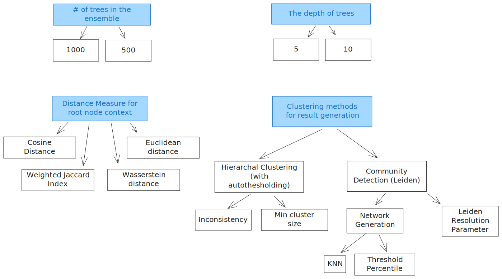

# CoRegTor-Benchmark
Benchmarking of co-regulatory modules predicted using the tool CoRegTor run on various publicly available gene expression datasets.

Here we describe the steps required for reproducing the results.

## Installation 

Clone the repo

```
git clone https://github.com/shubhvjain/coregtor-benchmark.git
```

This repo is setup using Poetry. So most commands are based on that. However other package management systems can also be used. 

To install all required dependencies 

```bash
poetry install --no-root
```


If you want to use standard virtual environment:
```bash
python -m venv venv
source venv/bin/activate
pip install .
```


## Setup

Create a new `.env` file in the root of the repo 

Here is the template:

```bash
DATA_PATH=${HOME}/coregtor-bio-datasets
EXP_TEMP_PATH=${HOME}/coregtor-temp
EXP_OUTPUT_PATH=${HOME}/coregtor-results
```

Vars needed:
- `DATA_PATH` the folder where biological database required will be stored. This also includes the open source gene expression data used. We will download the data in the next step
- `EXP_TEMP_PATH` this is the base folder where temporary files for experiment will be stored. each experiment will have a new folder
- `EXP_OUTPUT_PATH` this is the output folder where final experiment results will be stored. These results are available in the `results` folder in the repo. Either you can point to this folder or have any other location.
  
In path vars you can also use other env variables eg `$HOME,$PWD`

## Download data

All dataset required can be downloaded by running one command. The repo does not come with raw data. 

Note: Memory requirements at least 7.5 GB space. 

```bash
poetry run python code/data_setup.py
```

### Dataset info 


| Keyword | Description                                | Source |
| ------- | ------------------------------------------ | ------ |
| AMY     | Gene TPMs for Brain - Amygdala             | GTEx   |
| BLA     | Gene TPMs for Bladder                      | GTEx   |
| BLD     | Gene TPMs for Whole Blood                  | GTEx   |
| BA9     | Gene TPMs for Brain - Frontal Cortex (BA9) | GTEx   |
| BRE     | Gene TPMs for Breast - Mammary Tissue      | GTEx   |
| HYP     | Gene TPMs for Brain - Hypothalamus         | GTEx   |
| HRV     | Gene TPMs for Heart - Left Ventricle       | GTEx   |
| HRA     | Gene TPMs for Heart - Atrial Appendage     | GTEx   |
| KDC     | Gene TPMs for Kidney - Cortex              | GTEx   |
| LUN     | Gene TPMs for Lung                         | GTEx   |
| MUS     | Gene TPMs for Muscle - Skeletal            | GTEx   |
| PAN     | Gene TPMs for Pancreas (Islets)            | GTEx   |
| THY     | Gene TPMs for Thyroid                      | GTEx   |
|         |                                            |        |


 

## Running CoRegTor Experiment on a specific gene expression data

The first step is to run the experiments. We already have a list of experiment files available in the `experiments` folder. You can also create your own exp file. These are typical CoRegTor exp files defined [here]()

In analysis sections below we describe which experiments need to be run first.  Each experiment generates cluster result files and temp files. These are required for analysis.

### Run exp and generate results 
All experiment are run in the same way. 

Before running an exp, identify :
- path to `.env` file. This can be `$PWD/.env`
- path to experiment file. To use the experiment folder use  `$PWD/experiments`  (test1.json is a sample exp file)

```bash
#!/bin/bash
ENV_PATH="$PWD/.env"
EXP_PATH="$PWD/experiments/test1.json"

# Run a batch (run multiple times if needed )
poetry run coregtor_pipeline bulk batch  --config env=$ENV_PATH  input=$EXP_PATH items=10

# Generate results files
poetry run coregtor_pipeline bulk result  --config env=$ENV_PATH  input=$EXP_PATH name=result_name
```
The bulk command gives you the flexibility to run parallel jobs.

Here's a simple script to run bulk jobs on SLURM system:

```bash
#!/bin/bash -l
#SBATCH --nodes=1
#SBATCH --cpus-per-task=16
#SBATCH --mem=32G
#SBATCH --time=6:00:00
#SBATCH --partition=work
#SBATCH --job-name=test_results_bulk1
#SBATCH --export=NONE
#SBATCH --output=run.out

unset SLURM_EXPORT_ENV
module load python
cd $SLURM_SUBMIT_DIR
export http_proxy=http://proxy.nhr.fau.de:80
export https_proxy=http://proxy.nhr.fau.de:80


export ENV_PATH="$PWD/.env"
export EXP_PATH="$PWD/experiments/test1.json"

poetry run coregtor bulk batch  --config env=$ENV_PATH  input=$EXP_PATH items=250
```

The next step is to generate the result files. The options for each result type are defined in the experiment files under the "results" list. 

```bash
poetry run result --env=$ENV_PATH  --input=$EXP_PATH --id=r1
```

Then, we add validation indices to the results generated. 


## Exploring a single target in an experiment

To explore the results generated for a single target for an experiment

```python
TODO
```

## Analysis 1 : Parameter selection 

The goal of this analysis is to explore how different input parameters influence the quality of Co-Regulatory modules and suggest default parameters.

Here we use data from 500 targets run on 10 different GTEx tissue datasets. All the parameters are specified in the experiment files. 

Experiments to run:  
Run all the experiment in the folder `experiments/ps1` first. The folder `ps1` contains experiments with 1000 trees with depth of 5. Additionaly some results must be generated.

Here is a script for one dataset

```bash
#!/bin/bash -l
#SBATCH --nodes=1
#SBATCH --cpus-per-task=4
#SBATCH --mem=30G
#SBATCH --time=03:00:00
#SBATCH --partition=work
#SBATCH --job-name=test
#SBATCH --mail-type=ALL
#SBATCH --export=NONE
#SBATCH --output=run.out

unset SLURM_EXPORT_ENV
module load python
cd $SLURM_SUBMIT_DIR
export http_proxy=http://proxy.nhr.fau.de:80
export https_proxy=http://proxy.nhr.fau.de:80

export ENV_PATH="$PWD/.env"
export EXP_PATH="$PWD/experiments/test1.json"
export EXP_PATH_AMY="$PWD/experiments/ps1/amy.json"
export EXP_PATH_BLA="$PWD/experiments/ps1/bla.json"
export EXP_PATH_BLD="$PWD/experiments/ps1/bld.json"
export EXP_PATH_LUN="$PWD/experiments/ps1/lun.json"
export EXP_PATH_KDC="$PWD/experiments/ps1/kdc.json"
export EXP_PATH_STM="$PWD/experiments/ps1/stm.json"
export EXP_PATH_HRA="$PWD/experiments/ps1/hra.json"
export EXP_PATH_LIV="$PWD/experiments/ps1/liv.json"
export EXP_PATH_CDN="$PWD/experiments/ps1/cdn.json"
export EXP_PATH_PIT="$PWD/experiments/ps1/pit.json"

poetry run coregtor bulk batch  --config env=$ENV_PATH  input=$EXP_PATH_AMY items=500

poetry run result --env=$ENV_PATH  --input=$EXP_PATH --id=r0

poetry run python src/results/main.py --env=$ENV_PATH  --input=$EXP_PATH_AMY --id=r1


poetry run python src/results/main.py --env=$ENV_PATH  --input=$EXP_PATH_AMY --id=r2 --njobs=16
poetry run python src/results/main.py --env=$ENV_PATH  --input=$EXP_PATH_AMY --id=r3 --njobs=16


poetry run python src/results/main.py --env=$ENV_PATH  --input=$EXP_PATH_AMY --id=r31
poetry run python src/results/main.py --env=$ENV_PATH  --input=$EXP_PATH_AMY --id=r32

```

### Configurations 



Random commands:
```bash
poetry --no-cache add tfitpy@0.6.8
```